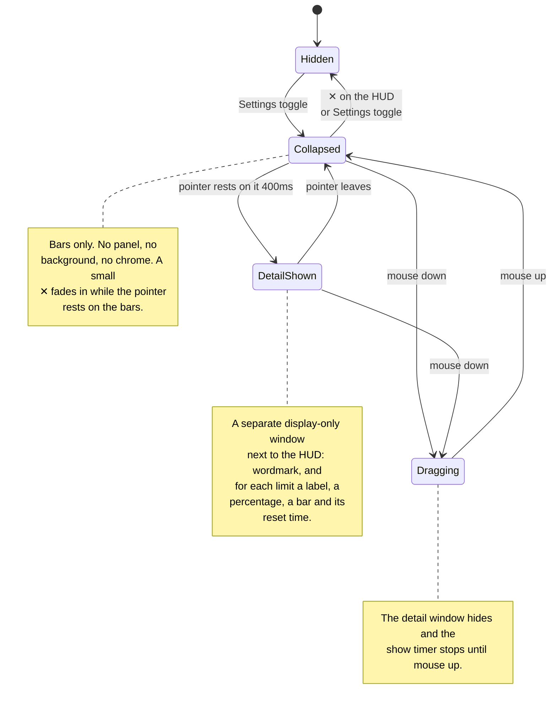

# antiburn HUD: states and positioning

_Behavior reference for the floating HUD and its platform and resource costs._

The HUD is a small always-on-top window that shows usage bars outside the menu.
Its native frame follows the visible bar panel and does not change on hover. A
hover shows the detail in a second window, like a large tooltip.

## The states

| State            | What you see                                                | Purpose                              |
| ---------------- | ----------------------------------------------------------- | ------------------------------------ |
| **Hidden**       | Nothing                                                     | The HUD is opt-in.                   |
| **Collapsed**    | Bare LED bars on a transparent background                   | It stays ambient.                    |
| **Detail shown** | The bars, plus a separate window with the spelled-out stats | It shows detail on request.          |
| **Dragging**     | The collapsed bars only                                     | It does not cover the drop position. |

### Transition details

- The detail window waits for a 400ms hover intent. It hides at once when the
  pointer leaves the HUD frame.
- The ✕ sits at the HUD's top right. It fades in as soon as the pointer enters
  the frame and adds no height.
- DOM mouse edges provide the focused path. The Rust crate polls the global
  cursor every 100ms for the background path and emits `overlay_hover`.
- A mouse down clears the pending show timer and hides a visible detail window.
  The timer stays suppressed until mouse up. After mouse up, a fresh 400ms count
  starts only when the pointer still rests on the HUD.
- Dragging starts on the panel except on the ✕. Only mouse release or window
  blur ends the drag. The drag moves the window manually at most once per
  animation frame.
- The detail window fades in over 100ms (`--duration-quick`). It hides with no
  transition. Reduced motion disables the fade.

### When there are no bars

The HUD shows one empty track when it has no reading to draw. The track is the
usual width with every segment off. The HUD does not hide itself and does not
change size.

The detail window names which empty it is:

| Condition                                   | Detail window text              |
| ------------------------------------------- | ------------------------------- |
| The reader turned off every meter           | `No meter selected.`            |
| A meter is on, but no provider reported yet | `No usage limits detected yet.` |

The two are different facts. The first is a choice the reader made in
Settings → Usage → Show Meter. The second is an absence of data. The HUD must
not report a setting as a failure.

The HUD polls the usage summary every 60 seconds and also listens for the
summary the shell pushes. The push is what makes a Show Meter switch reach the
HUD at once instead of on the next poll.

## The detail window

The detail window (`antiburn-hud-detail`) is pure display. It ignores cursor
events, never takes focus, and holds no controls. Settings stays reachable
through the tray.

The first hover creates the window hidden. After that it stays warm and only
shows and hides, like the popover. The HUD session owns the data: it pushes the
derived bars with the show call and again on every usage refresh while the
window is visible. The webview measures its rendered content and reports the
height. The shell sizes, places, and shows the window in one step, so it appears
at its final size.

A hide runs through the webview as well. The webview clears the card while it
can still paint, reports back, and only then does the shell hide the window. A
short fallback handles a missing report. An empty last frame keeps the next show
clean.

### Placement

- The anchor is the content-sized HUD frame.
- The window is 176 logical pixels wide and left-aligned with the HUD. It
  prefers the space below the HUD.
- It flips above the HUD when the space below would cross the screen's bottom
  margin.
- It clamps to the monitor that holds the HUD, with an 8px margin.
- The webview's transparent padding carries the drop shadow and forms the
  visible gap to the HUD.

## Positioning

The HUD's native frame is 176 logical pixels wide and exactly as tall as the
rendered bar panel, up to a 500px safety ceiling. The default position is
centered under the primary macOS menu bar, with a 24px menu-bar allowance and an
8px gap. Reopening a live window keeps the reader's position and measured
height.

### Remembered position

The HUD returns to where the reader put it, on the display they put it on.

Each drag stores an entry under the `internal:hudPlacements` scalar: the
display's identity, and the position as a logical offset from that display's own
top-left corner. The offset is relative because a new arrangement moves the
display itself in the shared desktop space. A display's identity is its name,
size, and scale factor; two identical monitors of one model make the same
identity.

The list is ordered by recency, holds 8 displays, and the head is the preferred
display. Placement takes the first entry whose display is connected, and clamps
the offset inside that display. Nothing remembered and connected means the
default position above.

**Only a drag reorders the list.** A display that disconnects makes the HUD fall
back to the next remembered display that is connected, and that fallback writes
nothing. So the preferred display stays at the head, and reconnecting it takes
the HUD back.

A 2-second poll compares the connected displays and replaces the HUD when the
set changes. Native visibility parks the poll while the HUD is closed. The same
resolution runs when the HUD is built and when it reopens, so a display change
during an off period is also caught.

The renderer measures the panel before the native window first appears.
Turning the HUD off cancels that pending reveal, even if the measurement arrives
later. Reopening uses the completed measurement. A later bar-count or font
change resizes the visible frame from its top edge. The 140ms native animation
uses the reduced-motion preference. Drag setup first snaps to the measured
height without animation, so the pointer origin matches the frame. A visible
detail window follows each animation frame, so a bar-count change keeps the two
windows joined.

The native frame reserves no transparent expansion space. Desktop clicks
outside the visible HUD reach the application underneath it.

## Stacking and spaces

The HUD and its detail window use nonactivating `NSPanel` subclasses that cannot
become key or main windows. Hidden creation and native reveal use the same
panel conversion mechanism as the menu-bar popover, without its keyboard-focus
step. The app keeps its regular activation policy for ordinary windows.

Before each reveal, the main-thread callback resolves or converts the panel,
sets its nonactivating style, and restores its stacking and Space policy. It
then uses `orderFrontRegardless()` without activating the app. Pending hide
requests still prevent a queued reveal. Conversion failure leaves the window
hidden instead of falling back to an ordinary window.

The panels retain the existing screen-saver level (1000) and
`CanJoinAllSpaces | FullScreenAuxiliary | Stationary | IgnoresCycle` policy.
The level controls stacking; it does not establish fullscreen-Space eligibility.
Manual QA of the prior ordinary-window implementation found that level 1000
alone did not make the HUD appear over another app's fullscreen Space.

The policy requests visibility across Spaces on the HUD's remembered display,
including fullscreen Spaces. There is only one HUD, not a copy on each display,
and it does not move to another display merely because an app there enters
fullscreen. Fullscreen visibility, Space switches, and passive interaction need
live macOS validation after changes to the native window mechanism.

## Data and timing

- Each LED bar has 20 segments.
- Only the first bar blinks during a live session, and only on the HUD. The
  detail window does not blink.
- A transcript write stays live for 90 seconds.
- The renderer reads liveness once when shown. Session and scan events push
  later changes, and one timer clears the live state at its expiry.
- The renderer polls usage every 60 seconds while shown.
- The native hover watcher polls every 100ms while the window is visible.
- Hiding the HUD parks the native polls and the retained renderer's timers.
- The HUD uses the Bitcount Prop Single Variable face for captions, numbers,
  and its wordmark.

## Preference and entry points

Native HUD preferences persist enabled state, dynamic appearance, and reveal edge
under `internal:dynamicHud`. Settings → Usage writes field-level changes through
the shell. The legacy `antiburn.showFloatingHud` localStorage value migrates once;
existing native preferences win. Relaunch restores an enabled HUD without waiting
for the popover to become visible after migration.

Settings follows `hud:settings`, not native visibility. The HUD close command
turns the enabled preference off. Dynamic conceal only hides the window, so the
setting stays on and edge retrieval continues. The renderer still receives
native work/visibility events to suspend hidden presentation work.

## Platform boundary

v1 is macOS-only. The native crate returns without creating a window on other
platforms, and the frontend hides the Settings entry point there. Windows needs tuning
for its taskbar position. Linux waits for reliable Wayland positioning and
always-on-top behavior.

## Rejected positioning designs

| Design                                      | Failure                                                  |
| ------------------------------------------- | -------------------------------------------------------- |
| Keep a fixed 500px transparent frame        | Invisible space blocks clicks in other applications.     |
| Expand the HUD panel in place               | Content shifts under the pointer and complicates drag.   |
| Make the complete window ignore mouse input | The visible HUD cannot drag or answer its close control. |
| Move the HUD to make room for detail        | The HUD leaves the position the reader chose.            |

The separate detail window and content-sized HUD frame close this list. The HUD
does not expand, and the detail window is sized before it appears.

## Dynamic appearance prototype

Settings → Usage keeps the master HUD preference separate from actual window
visibility. **Appear dynamically** is opt-in. An enabled HUD shows at launch or
enabling, after a 300ms dwell on the chosen screen edge, and when meaningful
Claude/Codex activity resumes after an hour without session activity. Startup
and old transcript replay do not count as a new session return.

The first reveal per app run/enabling stays for five seconds from native
visibility. After its first automatic dismissal, later reveals stay for three
seconds. Hover holds the HUD open and restarts the current countdown. Conceal
slides toward Top, Left, Right, or Bottom using the design system's 300ms slow
duration, then hides the native frame. Reduced motion removes the slide.

Dynamic placement centers on the selected edge of the display's work area.
Without a saved position, the pointer's display determines a hidden HUD's next
reveal; an already-visible HUD stays on its display. Shared display seams and corners do not retrieve it.
Both modes support dragging and restore the newest connected display's saved
position from `internal:hudPlacements`. Default edge placement applies only
when no saved display is available. A drag holds native dismissal and placement
updates; release flushes the last move before saving, then starts the full
current countdown. A click without movement does not create a saved position.
Saved and resized frames clamp to the work area. Display arrangement and safe
area changes trigger the existing watcher; a missing or changed-DPI display
uses the fallback without replacing the saved entry. The selected edge remains
the retrieval gesture and slide direction at a custom position.
Show HUD in Settings is keyboard-operable when screen edges are inconvenient.
Closing the HUD disables it; automatic conceal leaves it enabled.

The controller reuses validated semantic records from normal and targeted
scans. Its freshness follows the existing watcher/scoped scheduler; it does not
add a token threshold, a provider request, or a second filesystem watcher.
See [the prototype plan](plans/dynamic-hud-prototype.md) for timing tests and
native UX cases still awaiting validation.
