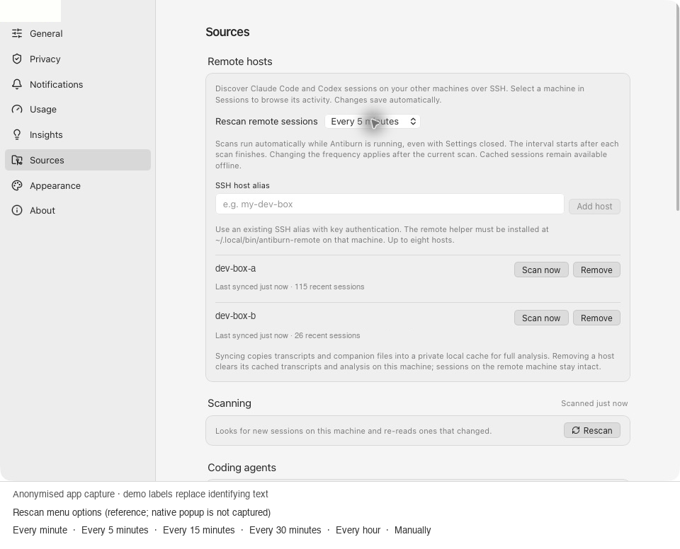
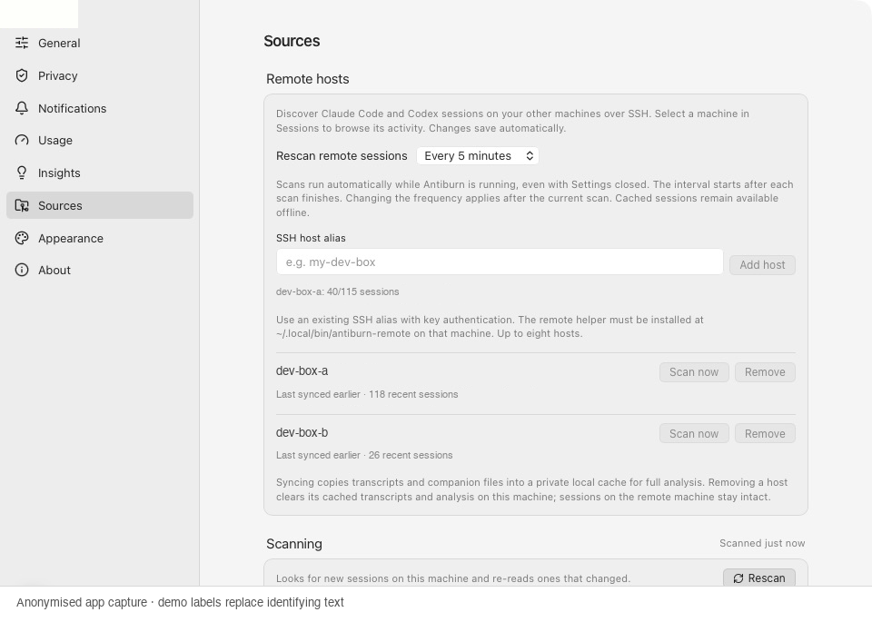
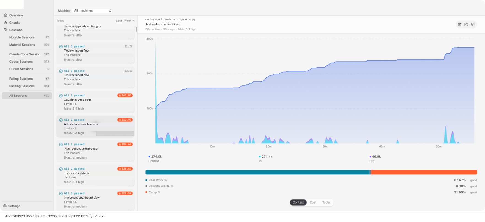
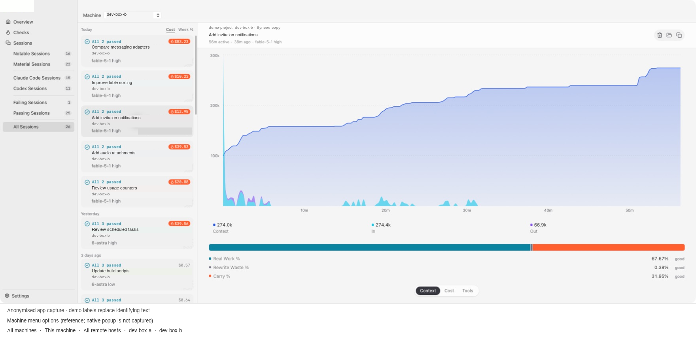
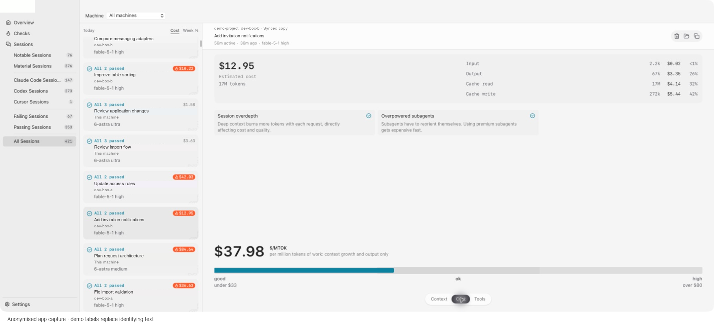
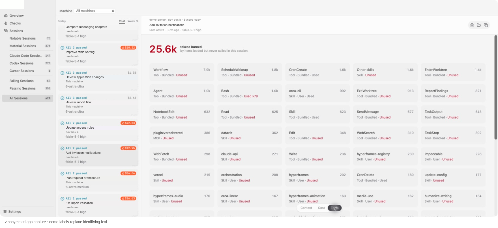

# Remote sessions in this fork

This fork imports Claude Code and Codex sessions from user-owned Linux hosts over SSH.
Raw transcripts and companion files enter a private local cache. The desktop's
normal evidence worker analyses them, and the standard Sessions list and detail
view display them alongside local sessions. No server or background daemon is needed.

## Current behaviour

- Configure SSH aliases under **Settings → Sources → Remote hosts** (up to eight).
- Scans run on app launch and automatically every five minutes after each host's
  previous scan finishes, including failed attempts. Added hosts scan on the next scheduler pass, after any active scan.
- Set **Rescan remote sessions** in Settings to one, five, fifteen or thirty minutes,
  hourly, or manual. The preference survives restarts. Manual mode stops future
  automatic scans; an active scan finishes. The app must be running.
- **Scan now**, progress, connection errors and cached snapshot times live in Settings.
  Scans never overlap or queue behind an active scan. Changing the Machine filter
  does not connect. Cached sessions remain usable while scans run or hosts are offline.
- **Machine** offers All machines, This machine, All remote hosts and individual hosts.
  Session rows and detail headers retain their source host.
- The usual session filters, context history, tools, model and token breakdowns,
  cost estimates, per-session checks and subagent navigation use the same pipeline.
- Discovery covers up to 200 recent sessions per host over seven days. The UI
  reports truncated lists and skipped sources. Archived-source discovery is unchanged.
- Claude bundles preserve child transcripts and metadata sidecars, plus a declared
  fork parent's transcript when available. Inferred Claude forks link to the same
  host's cached parent, so inherited messages are not counted twice. Existing engine
  coverage limits still apply.
- Sync skips unchanged bundles; a changed bundle is transferred in full. New copies
  are staged and validated before replacing the index. Failed transfers retain the
  previous usable copy. Successfully imported sessions remain visible after partial failure.
- Cached sessions remain readable offline and are marked as synced copies, without
  claiming that their remote processes are currently running.
- The native Overview, global Burn Checks report, provider account quotas and local
  configuration remediation keep their existing native-machine scope. Remote session
  checks are available in session details. Remote quota shares are unknown; local
  account credentials are never attributed to a remote session.
- Source aliases define separate identities, including when the same transcript ID
  exists on several machines. Renaming an alias creates another source.
- Removing a host removes its indexed sessions, cached transcripts and analysis.
  Deleting session data clears its index; syncing can import it again. The private
  transcript cache remains until resync or host removal. Local index clearing does
  not remove that cache. Original remote files are never edited or deleted.

Session bodies, titles, working directories, IDs and supporting sidecars travel over
SSH to this desktop. They are sensitive local data. Transcript directories are
owner-only and transcript files use mode 0600. No credentials, provider account
configuration, project source trees, or arbitrary caller-supplied paths are copied.
Cost estimates use the desktop's pricing catalogue, as local sessions do.

Bundles contain at most 512 files and 1 GiB of content. Sync stops when existing
transcript caches exceed 14 GiB, leaving up to 2 GiB for staged transfer and extraction.
Remove an unused host in Settings to reclaim space. A session larger than the bundle
limit reports an error; it is not silently truncated. Unused generations for a session
are removed on its next sync. Background scans use the saved frequency and do not require an open window.

## UI walkthrough

These are captures of the installed macOS app with identifying text covered by
opaque replacements. Host aliases, session titles, project labels and sync times
use demo labels; charts, controls and analysis remain from the captured interface.
No raw captures or private paths are included. Native macOS popup menus are not
included by the capture API, so the exact menu choices are transcribed as labelled
references beneath the setup and machine-filter images.

### Host setup and rescan frequency

Add or remove SSH hosts, choose the automatic interval, and run an optional scan
from **Settings → Sources → Remote hosts**. Frequency choices are every minute,
five minutes, fifteen minutes, thirty minutes, hourly, or manual.



### Background progress

Progress and last-sync status stay in Settings. Host actions are disabled while a
scan runs; cached sessions remain readable.



### Unified sessions and context

Local and remote sessions share the normal list, filters and analysis. Each row
identifies its source, and remote details identify the session as a synced copy.



### Machine filter

The machine dropdown offers All machines, This machine, All remote hosts and each
configured host. Selecting a host keeps the standard session-analysis interface.



### Costs and session checks

Remote sessions retain token categories, estimated cost, efficiency and supported
per-session Burn Checks.



### Tools

The normal Tools tab shows loaded tools, skills and MCP entries, their token
footprint and usage evidence for the remote session.



## Build and install the Linux helper

Use Rust 1.97 or newer and a C compiler on the build machine:

```sh
cargo build --release --manifest-path crates/antiburn-remote/Cargo.toml
install -Dm755 crates/antiburn-remote/target/release/antiburn-remote \
  "$HOME/.local/bin/antiburn-remote"
```

The helper can be copied to another compatible Linux machine with the same
architecture and a compatible libc. A desktop environment is not needed.
Install it for the same Linux user whose agent sessions should be inspected.
Non-interactive SSH may not inherit shell environment overrides: ensure
`CODEX_HOME` / `CLAUDE_CONFIG_DIR` are available to that invocation if customised.
Otherwise the engine uses its standard home-directory locations.

Verify the SSH alias normally first so its key is in `known_hosts`. The app uses
batch authentication and strict host-key checking; it never accepts a new key.
The remote command is fixed as `~/.local/bin/antiburn-remote stdio`.

On macOS, direct LAN connections may need Local Network permission. The fork
bundle declares that purpose. If an SSH child cannot reach a direct interface
from the app, an existing VPN route can use a separate SSH alias while the
terminal's original alias remains unchanged. Verify the server host key against
the already trusted connection before adding an alternate endpoint.

```sh
printf '%s' '{"operation":"list","version":1}' | \
  ssh -T build-box '~/.local/bin/antiburn-remote stdio'
```

Protocol version 1 supports `list`, legacy `analyze`, and `export` with `agent`,
`session_id` and an optional 64-character `known` bundle signature. Export selection
must match discovery; callers cannot supply a source path. Install the updated helper
on every host before syncing with this desktop build.

List and legacy analysis return bounded JSON (8 MiB, 60-second timeout). Export
streams `ABR2DATA` or `ABR2SAME`, a little-endian 32-bit manifest length, the JSON
manifest (at most 1 MiB), and file contents in manifest order. Desktop extraction
uses validated identities and generated paths. Export has a 180-second timeout per
session and rejects incomplete, excess or changed-during-transfer data. Requests
are capped at 8 KiB and error output at 8 KiB. Desktop operations are serialised,
including host removal. The local CLI `ssh` mode supports JSON requests only;
the desktop transport handles binary exports.

## Build the separate macOS app

```sh
pnpm install --frozen-lockfile
pnpm --filter @antiburn/desktop tauri build \
  --config src-tauri/tauri.remote.conf.json --bundles app
```

The bundle is **Antiburn Remote.app**, with a separate application identifier and
storage directory. Local bundles receive an ad-hoc app signature; distribution
to other users would need separate signing and notarisation. This configuration
disables upstream updates so an upstream
release cannot replace the fork. Default builds exclude product analytics;
remote host names, titles and metrics have no new analytics events. This is an
intentional measurement gap for the prototype.

## Verification

Run the helper's protocol tests, Clippy and formatter, the desktop frontend
checks and the shell checks from `CONTRIBUTING.md`. Protocol fixtures are synthetic.
Never add collected host output, real transcripts or private machine configuration
to this repository.

## Follow-up work before proposing upstream integration

- Agree on stable source identity independent of SSH aliases.
- Extend global reports and remote configuration remediation with explicit machine scopes.
- Add per-file deltas and capability negotiation to reduce transfer costs.
- Extend archived-session discovery and review additional agent formats.
- Review a user-facing SSH setup flow and Linux binary release packaging.
